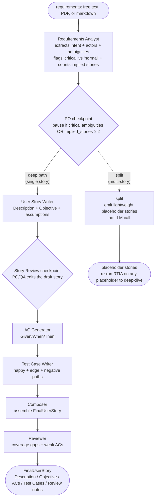

# RTIA - Requirements & Test Intelligence Assistant

A multi-agent AI assistant that takes raw software requirements - feature requests, business requirements, PRD snippets, or meeting notes - and produces a structured user story, acceptance criteria (Given/When/Then), and test cases through a supervised pipeline.

Two human-in-the-loop checkpoints keep a PO or QA Lead in control: one *before* story generation (to resolve critical ambiguities) and one *after* (to review the generated story before AC generation).

## How It Works



**Two paths, one PO decision.** At the PO checkpoint, RTIA picks the path based on how many distinct user stories the Analyst inferred:

- **Deep path** (`implied_stories ≤ 1`) - produces a full four-section artifact: Description, Objective, Acceptance Criteria, Test Cases.
- **Split path** (`implied_stories ≥ 2`) - produces lightweight placeholder stories only. The PO picks a placeholder later and re-runs RTIA on it to deep-dive. See [PR #162](https://github.com/augustineuzokwe/rtia/pull/162) for the topology rationale.

**Why two checkpoints on the deep path?** They do different work that the other can't:

- The **PO checkpoint** resolves missing information *before* the system makes assumptions. The Analyst classifies each ambiguity by severity so the PO only pauses for genuinely blocking questions, not every detail.
- The **Story Review checkpoint** verifies the *output* - catching cases where the Story Writer's interpretation of the resolved inputs doesn't match what the PO actually meant.

**Where the artifact goes.** The composed `FinalUserStory` is downloadable as JSON from the API, viewable in the Gradio UI, and exportable to Jira (REST v3 + ADF) or GitHub Issues (with optional Projects v2 placement) via `POST /pipeline/{thread_id}/export`. Split placeholders export via `/export-deferred`.

> **Glossary (docs vs code mapping):** docs call this "split path" + "placeholder stories" because that reads naturally in product/PM language. The code uses the same vocabulary - LangGraph node `split`, state field `split_stories`, JSON values `"mode": "split"` / `"status": "done_split"`. See [docs/glossary.md](docs/glossary.md) for the full vocabulary reference.

## Use Case

A PO or BA has raw requirements. Instead of manually writing user stories, ACs, and test cases from scratch, they paste the requirements into RTIA. The system generates a first draft at each stage. The PO answers a small number of critical clarifying questions up front and reviews the generated story before the pipeline continues to AC generation.

**Input formats:** Free text · PDF · Markdown (uploaded through the UI or sent as JSON to the API).
**Output destinations:** JSON download · Gradio UI render · push to a Jira project · push to a GitHub repository's Issues + Projects v2 board.

> **End-user guide:** if you're a PO, BA, or QA lead using RTIA rather than building it, read [docs/USAGE.md](docs/USAGE.md) - it walks you from "I have a requirement" to "I have a backlog-ready artifact" without assuming any developer knowledge.

## Stack

| Layer | Tool |
|---|---|
| Agent orchestration | LangGraph (Python) |
| LLM abstraction | LangChain (Python) |
| LLM provider (default) | Google Gemini 3.5 Flash via `langchain-google-genai` |
| LLM provider (full-local) | Ollama (Llama 3.1 8B) via `langchain-ollama` |
| Durable state | SQLite checkpointer (`langgraph-checkpoint-sqlite`) |
| LLM evaluation | DeepEval |
| Tracing | LangSmith (opt-in) |
| API | FastAPI + bearer-token auth |
| UI | Gradio Blocks (mounted at `/`) |
| Exporters | Jira REST v3 (ADF) · GitHub Issues + Projects v2 (GraphQL) |
| CI/CD | GitHub Actions |

## Project Structure

```
rtia/
├── agents/          # LangGraph agent definitions (Analyst, Story Writer, AC Gen, Test Case, Reviewer, Composer)
├── prompts/         # Prompt templates (one module per agent; versioned with code)
├── api/             # FastAPI routes + bearer-token auth + exporter bridge
├── ui/              # Gradio Blocks frontend (mounted at /)
├── exporters/       # Jira + GitHub backends behind one Exporter Protocol
├── evals/           # Golden samples + DeepEval suite + N-runs runner
├── scripts/         # Demo + API entry points (run_pipeline_demo.py, run_api.py)
├── tests/           # Mocked unit tests (see tests/README.md for the category map)
├── docs/            # ADRs, USAGE.md, ci-and-testing.md, blog drafts
└── .github/
    └── workflows/   # CI (eval gate) + nightly safety regression
```

## Getting Started

### Prerequisites

- Python 3.13+
- [uv](https://docs.astral.sh/uv/) for dependency + venv management
- A Google AI Studio API key for Gemini ([get one](https://aistudio.google.com/app/apikey))
- (Optional) A LangSmith API key for observability ([get one](https://smith.langchain.com))
- (Optional) [Ollama](https://ollama.com/download) installed locally for the $0-API-spend full-local mode

### Setup

```bash
git clone https://github.com/augustineuzokwe/rtia.git
cd rtia
uv sync                          # install deps into a local .venv
cp .env.example .env             # then fill in your keys (see below)
uv run pre-commit install        # one-time: enable the pre-commit hooks
```

### Platform notes

The setup commands above assume **macOS, Linux, or WSL** (POSIX shell). RTIA's *runtime* - `uv`, Python, the agents, the cache, LangGraph - is cross-platform; only the *setup shell syntax* differs. Translations for Windows-native and Linux:

| What | macOS / Linux / WSL (default in this README) | Windows PowerShell | Windows cmd |
|---|---|---|---|
| Copy `.env` template | `cp .env.example .env` | `Copy-Item .env.example .env` | `copy .env.example .env` |
| Set an env var inline | `export RTIA_LLM_PROVIDER=ollama` | `$env:RTIA_LLM_PROVIDER = "ollama"` | `set RTIA_LLM_PROVIDER=ollama` |
| Install Ollama (only needed for full-local mode) | macOS: `brew install ollama` · Linux: `curl -fsSL https://ollama.com/install.sh \| sh` | Installer from <https://ollama.com/download> | Installer from <https://ollama.com/download> |

Everything else in the recipe - `uv sync`, `uv run …`, the `.env` file format - is identical on every platform.

### Environment variables

`.env.example` documents every variable. The minimum to run the demo:

```
GOOGLE_API_KEY=...               # Google AI Studio key - RTIA defaults to Gemini 3.5 Flash
```

Optional but recommended - **LangSmith tracing** (every LLM call surfaces with token counts, latency, and full input/output in the LangSmith UI):

```
LANGSMITH_TRACING=true
LANGSMITH_API_KEY=lsv_...
LANGSMITH_PROJECT=rtia
```

Tracing is purely opt-in. Production-trace safety (refuses to start under `RTIA_ENV=production` + tracing) is covered by [ADR-0008](docs/adr-0008-pii-langsmith.md).

### Deeper topics - pointers, not duplication

The README intentionally stops at "what you need to get running." For each topic below, the linked doc has the design rationale + the env-var contract + the trade-offs:

- **LLM response cache** - disk-backed, prompt-hash keyed, 24h TTL, disabled in CI. Env vars: `RTIA_LLM_CACHE`, `RTIA_LLM_CACHE_TTL`, `RTIA_LLM_CACHE_DIR`. See [ADR-0013](docs/adr-0013-llm-response-cache.md).
- **Stochastic AC validation (N-runs)** - `--n-runs N` on the eval runner, pass-rate gating, nightly cron at 02:00 UTC on adversarial samples. See [ADR-0014](docs/adr-0014-stochastic-ac-validation.md) and [USAGE §9](docs/USAGE.md#9-stochastic-ac-validation-for-adversarial-samples).
- **Full-local mode ($0 API spend)** - set `RTIA_LLM_PROVIDER=ollama` + `RTIA_OLLAMA_JUDGE=1`. Default uses Gemini at ~$0.005/demo, ~$0.03/eval; full local uses Ollama for both generator and judge. See [USAGE §10](docs/USAGE.md#10-running-rtia-with-zero-api-spend-full-local-mode).
- **When tests fire (CI + nightly cron)** - full trigger table, PR timeline, 24h timeline, and a mental-shortcut table at [docs/ci-and-testing.md](docs/ci-and-testing.md).

### Run the demo

```bash
uv run python scripts/run_pipeline_demo.py
```

The demo runs the pipeline against `evals/sample-requirements/sample-01-well-structured.md`, pauses for PO input if the Analyst flagged critical ambiguities, and prints the generated user story. If tracing is on, the script prints a link to the LangSmith dashboard at the start of the run.

### Run the API + UI (Phase 14)

```bash
uv run python scripts/run_api.py
```

Starts a FastAPI server on `127.0.0.1:8000` with a Gradio UI mounted at `/`. The startup banner prints a tokenized URL (`http://127.0.0.1:8000/?token=…`) - open it in a browser to paste a requirement or upload a PDF/Markdown file and step through the PO and review checkpoints. All API endpoints require `Authorization: Bearer <token>`; set `RTIA_API_TOKEN` in `.env` to pin a stable token across restarts.

### Run the tests

```bash
uv run pytest -q                 # unit tests (mocked, offline)
uv run pre-commit run --all-files
```

> **What gets tested when:** the suite spans mocked unit tests (every PR), a live Gemini eval gate (PRs touching `agents/`, `prompts/`, or `evals/`), and a nightly N=10 adversarial regression at 02:00 UTC. See [docs/ci-and-testing.md](docs/ci-and-testing.md) for the full trigger map.

## Workshop Context

This project is a learning workshop for a QA Lead transitioning into AI-first quality engineering. It is used to:

- Practice agentic AI design (LangGraph multi-agent pipelines)
- Practice prompt engineering (requirements → stories → ACs → tests)
- Build and test an LLM evaluation pipeline (DeepEval + GitHub Actions)
- Document a QA team AI adoption roadmap using this app as the test subject
